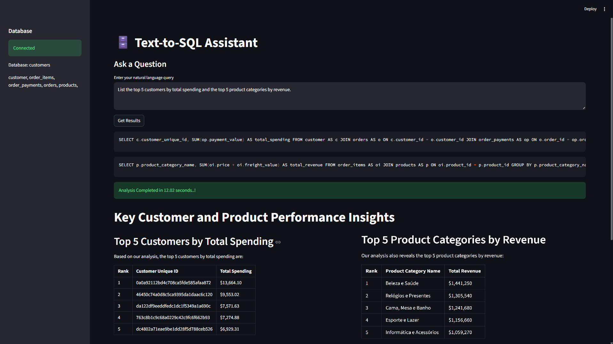

# 🗄️ Text-to-SQL Analytics Assistant

A natural-language analytics tool that lets you ask business questions in plain English and get back SQL-backed, stakeholder-ready insights — built on a schema-aware, validated, retry-enabled LLM pipeline

> Ask: *"What are the top 10 products by revenue?"*
> Get: A generated SQL query, executed results, and a plain-language business summary — no SQL knowledge required from the end user.

---



## How It Works

```
Natural Language Question
        ↓
Dynamic Schema Extraction (live MySQL introspection)
        ↓
LLM Generates SQL Execution Plan (Gemini 2.5 Flash)
        ↓
LLM Validates the SQL (Llama 3.1 8B via Groq)
        ↓
Retry / Repair Loop (up to 2 attempts if validation fails)
        ↓
SQL Execution (read-only, keyword-guarded)
        ↓
Business Insight Generation (Llama 3.1 8B)
```

Each question is handled by a dedicated LLM call at each stage, using **Pydantic structured outputs** so the pipeline never has to parse free-text LLM responses — every stage returns a typed, validated object.

---

## Key Engineering Features

- **Dynamic schema extraction** — reads the live database's `information_schema` on connect, so the LLM always sees the actual table/column structure rather than a hardcoded description.
- **Multi-query planning** — a single question like *"highest revenue state and most used payment method"* is automatically split into multiple independent, correctly-named SQL queries rather than being forced into one convoluted statement.
- **Structured output via Pydantic** — SQL generation and validation both return typed schemas (`SQLPlan`, `ValidationResult`), eliminating brittle text parsing.
- **Two-model design** — Gemini 2.5 Flash handles generation, Llama 3.1 8B (Groq) handles validation and final reporting, testing both a slower/stronger model and a fast/cheap model in the same pipeline.
- **Validation before execution** — every generated query is checked against an 8-point rubric (intent match, schema correctness, join correctness, filters, aggregation, sorting/limiting, semantic correctness, and a DML-safety check) before anything touches the database.
- **Retry-and-repair loop** — if validation fails, the failure reason is fed back into a new generation attempt (up to 2 retries) rather than simply failing.
- **Result-size limiting** — query results are capped before being sent back into the LLM for summarization, to control token usage and latency.
- **Business insight generation** — final output is plain-language, stakeholder-facing prose, with the underlying SQL/database never mentioned.

---

## ⚠️ Local-Only by Design

This application is designed for local execution against a user-managed MySQL database. Public deployment is intentionally out of scope because securely exposing arbitrary private databases requires networking infrastructure such as VPNs, SSH tunnels, or private network peering. The focus of this project is the LLM-driven analytics pipeline rather than production networking.

---

## Tech Stack

| Layer | Technology |
|---|---|
| Frontend | Streamlit |
| Database | MySQL |
| Orchestration | LangChain |
| Generation LLM | Gemini 2.5 Flash |
| Validation / Reporting LLM | Llama 3.1 8B (Groq) |
| Structured Outputs | Pydantic |
| Data Handling | Pandas |

---

## Project Structure

```
.
├── app.py               # Streamlit UI, DB connection, session state
├── llm_pipeline.py       # Orchestrates generation → validation → retry → execution → insight
├── generator.py          # SQL generation call (Gemini, structured output)
├── validator.py          # SQL validation call (Llama 3.1 8B, structured output)
├── schema_extractor.py    # Live schema introspection via information_schema
├── prompts.py            # Generation / validation / final-report prompt templates
├── schemas.py            # Pydantic models: SQLPlan, SQLQuery, ValidationResult
└── .env                  # Local DB credentials (not committed)
```

---

## Setup

1. Clone the repo and install dependencies:
   ```bash
   pip install -r requirements.txt
   ```

2. Create a `.env` file in the project root with your local MySQL credentials and API keys:
   ```
   host=localhost
   port=3306
   user=your_mysql_user
   password=your_mysql_password
   database=your_database_name
   ```
   (API keys for Gemini and Groq are configured separately — see `all_api.py` / your own key management approach.)

3. Run the app:
   ```bash
   streamlit run app.py
   ```

4. On load, the app connects to your local MySQL database, extracts the schema automatically, and is ready to take natural-language questions.

---

## Known Limitations

- **SQL safety is currently keyword-based** (blocks `UPDATE`, `DELETE`, `DROP`, `ALTER`, `INSERT`, `TRUNCATE`, `CREATE`, `REPLACE` as substrings). This is a first line of defense, not a complete guarantee — a production version would run under a database-level read-only role as well, and enforce single-statement execution.
- **Local-only deployment.** See the note above — this is intentional, but means the app is not currently runnable as a hosted public demo.
- **Small-model structured-output reliability.** Llama 3.1 8B occasionally fails to return a well-formed structured tool call under Groq; the pipeline retries and fails closed (treats unparseable validation as invalid) rather than crashing.
- **No automated tests yet.** Validation is currently manual/interactive.

---

Example Questions

• Which state generated the highest revenue?\
• Show the top 10 customers by total spend.\
• Which payment method is most commonly used?\
• What are the highest-selling product categories?\

## Why This Project

This project was built to demonstrate the core skills of a modern, AI-augmented Data Analyst workflow: schema-aware SQL generation, validation and self-correction, and translating raw query results into business-ready language — while being explicit about where the design stops short of production-grade infrastructure, and why. Demonstrated using the Brazilian Olist E-commerce dataset stored in MySQL.
